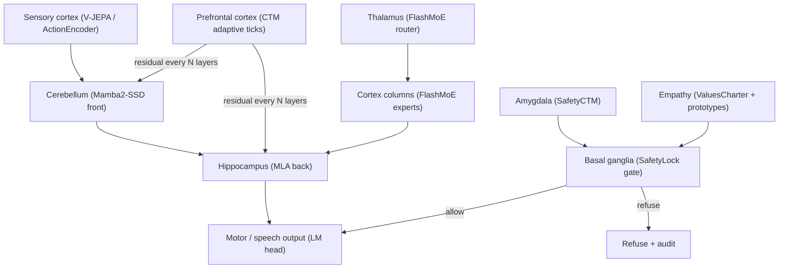

# Luna Neuro-Architecture: Brain-Region → Structure Mapping

## Goal

Top-tier capability at the **lowest local hardware cost**. We analyze the human
brain by region, map each region's function to the Luna module that implements
it at the highest performance-per-FLOP, and run the whole stack on the
`tiny`/`1b` ladder for local CPU/low-end-GPU inference.

## Brain regions → Luna structures

| Brain region | Function | Luna module | Why this module (perf-per-FLOP) |
|---|---|---|---|
| Prefrontal cortex | Executive function, deliberation, planning | `CTM` (1-4 adaptive ticks) | Adaptive compute: simple → 1 tick, hard → 4. Pays only when needed. |
| Hippocampus | Episodic memory, recall | `MLA` (latent KV compression) | Compressed KV = long memory at low VRAM; YaRN → 128K context. |
| Cerebellum | Fast habitual / sequential processing | `Mamba2-SSD` | O(1) state, no KV growth → cheapest long-context encode. |
| Thalamus | Sensory relay / routing | `FlashMoE` router | Top-K gate = sparse relay; only K experts fire. |
| Cortex columns | Specialized capabilities | `FlashMoE` experts | Sparse MoE: huge total capacity, small active cost. |
| Amygdala | Threat / safety detection | `SafetyCTM` | Cognitive safety loop: predicts consequence, refuses threats. |
| Basal ganglia | Action selection / go-no-go | `SafetyLock.gate` | The single decision gate: allow/refuse. |
| Corpus callosum | Inter-region integration | CTM residual injection | Global CTM state broadcast to every layer. |
| Sensory cortex | Perception | `V-JEPA` + `ActionEncoder` | JEPA world model + text encoder = sensory front. |
| Mirror neurons / empathy | Align with others' welfare | `ValuesCharter` + `ForbiddenPrototypeSet` | Values floor + anti-humanitarian prototypes → prosocial gating. |

## Data flow (cognitive brain)

## Why this is the highest-perf-per-FLOP structure

- **Adaptive compute** (CTM): pays full depth only on hard inputs.
- **O(1) memory encode** (Mamba2-SSD): no KV growth on long context.
- **Compressed memory** (MLA): 32× KV compression → long recall at low VRAM.
- **Sparse capacity** (FlashMoE): 550B total / ~77B active → big brain, small per-token cost.
- **Cognitive safety** (SafetyCTM): threat detection without a separate heavy model.
- **Values floor** (ValuesCharter): prosocial alignment as a cheap immutable check.

## Lowest-local-hardware operating point

| Preset | Hardware | Role |
|---|---|---|
| `tiny` | CPU / 1×8GB | dev, evolve smoke, safety+values tests |
| `1b` | 1×24GB | local e2e on a consumer GPU |
| `7b` | 1–8×80GB | capability sprint |
| `550b` | multi-node | challenge (only after genomes stabilize) |

For "top model at lowest local cost," run `1b` locally with INT4 KV + CTM
early-exit + MoE hot/cold expert placement. The cost model (`cost_model.py`)
quantifies $/MTok and peak VRAM per preset.

## Safety + loyalty model (brain analogue)

- **Amygdala + basal ganglia** = `SafetyLock` (charter hard floor + CTM soft judge).
- **Empathy / values** = `ValuesCharter` (humanitarian + socialist core values'
  prosocial substance) — an immutable second hard floor. The AI is loyal to
  **humanity** (values floor) and to the **operator** (黄照清) for priority
  service, but values bind the operator too: anti-humanitarian operator
  requests are refused.
- **Self-evolution** = `evolve/` + `code_evolve/`, gated by safety + values
  + cognitive tests, sandboxed, audited. The brain optimizes itself without
  ever weakening the amygdala, basal ganglia, or empathy layers (`safety/`
  is immutable to self-evolution).
